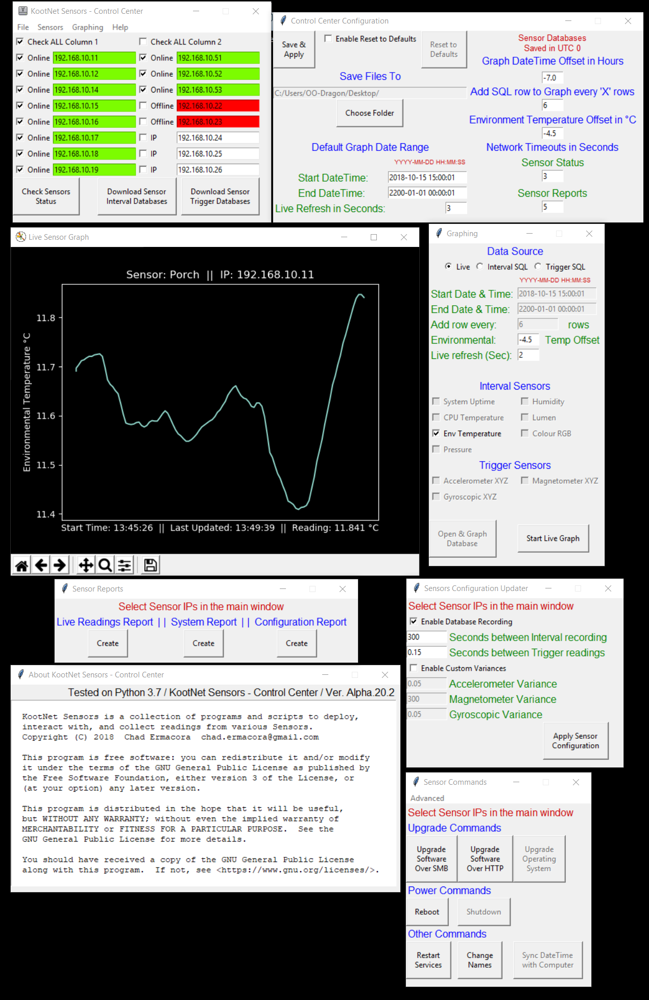

# KootNet Sensors - PC Control Center
A Python3 program made to interact with Raspberry Pi's running the Raspberry Pi Sensor Software.  More information about the Raspberry Pi Sensor Software can be found through the link below. 

Installers for Windows are available as well as a installer script for Linux (WIP).  The software is in a alpha state and is prone to bugs and changes that may break backwards compatibility between releases.

[Project Website](http://kootenay-networks.com/?page_id=170)

[KootNet Sensors Downloads and Instructions](http://kootenay-networks.com/?page_id=236)

[Raspberry Pi Sensor Software](https://github.com/chad-ermacora/sensor-rp)

PC Control Center - WIP
-----------------------
Demo screen shot of the program (Version Alpha.19.1) and some of its functions.

##### Some of the features include
- Change sensor's configuration
- Change sensor hostname (Used in database as sensor name)
- Sync Date & Time with the local computer's Date & Time
- Download sensor databases
- Graph databases
- View sensor Online/Offline status
- View System & Configuration reports of one or more sensors
- Upgrade sensor software
- Upgrade Operating System
- Restart sensor services
- Reboot or Shutdown Sensor

