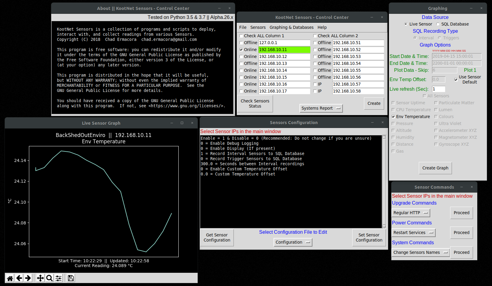

# KootNet Sensors - Control Center
KootNet Control Center is a Python3 program made to interact with Raspberry Pi's running the KootNet Sensor Software.  
More information about the Raspberry Pi Sensor Software can be found through the link below. 

Installers for Windows are available as well as a installer script for Linux. - WIP  
The software is in an alpha state and is prone to bugs and changes that may break backwards compatibility between releases.

[Project Website](http://kootenay-networks.com/?page_id=170)

[KootNet Sensors Downloads and Instructions](http://kootenay-networks.com/?page_id=236)

[Raspberry Pi Sensor Software](https://github.com/chad-ermacora/sensor-rp)

Control Center - WIP
-----------------------
### Some Features Include
- View sensor Online/Offline status
- Download sensor databases
- Graph offline databases or view a live graph from an online sensor
- View system, configuration & sensor reading reports (Made for a quick view of multiple sensors)
- View or download Sensor Logs
- Change sensor's configuration
- Upgrade sensors software
- Upgrade sensor operating system
- Restart sensors services
- Reboot or shutdown sensors
- Change sensor hostname (Used in database as sensor name)
- Sync Date & Time with the local computer's Date & Time

